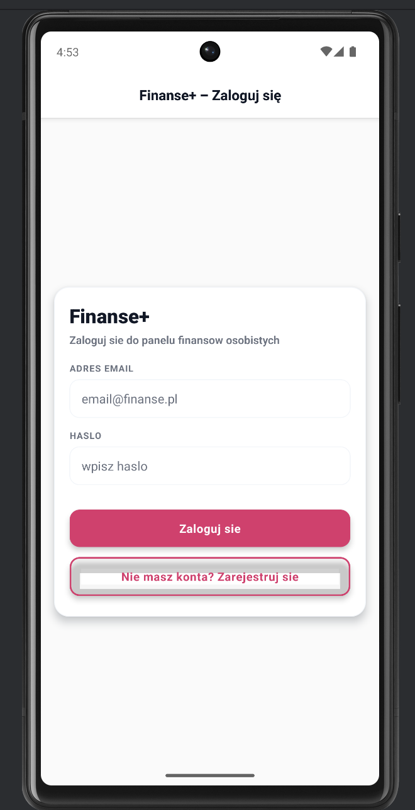
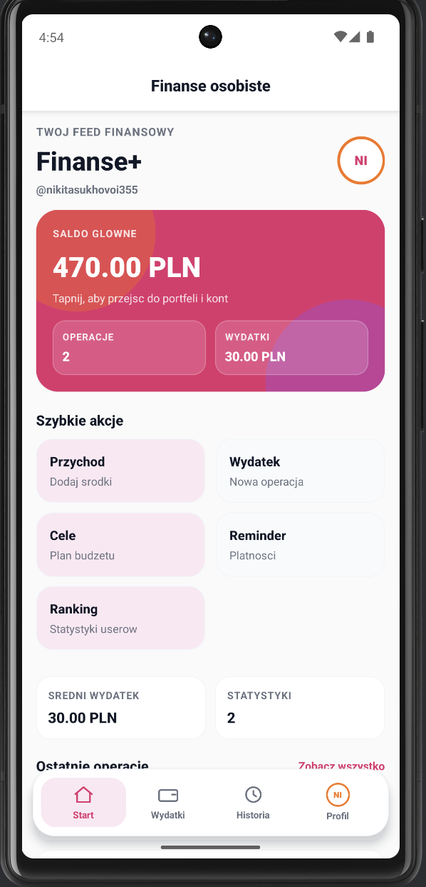
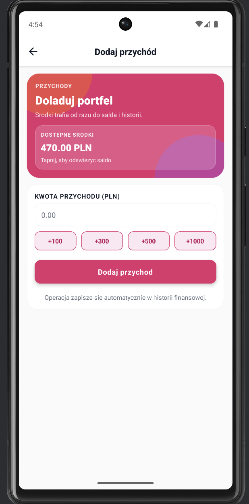
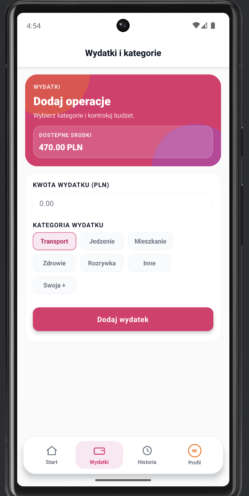
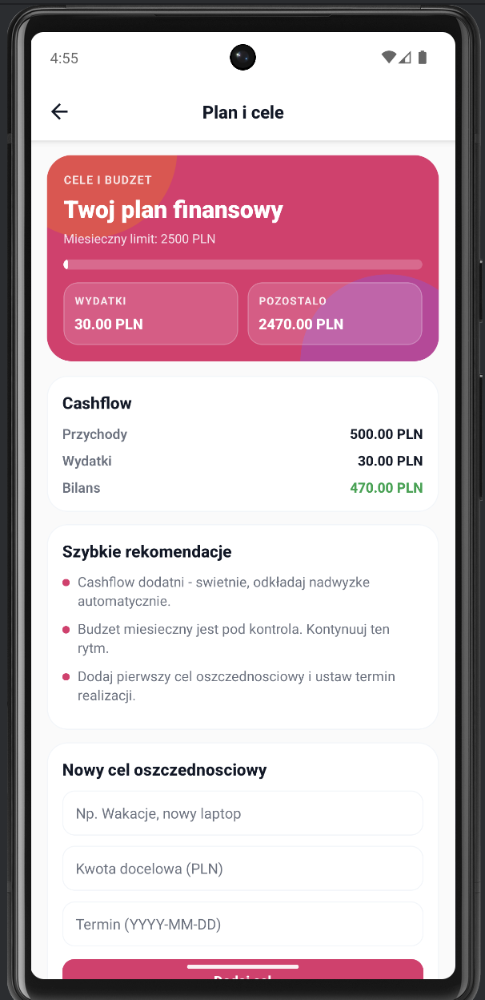
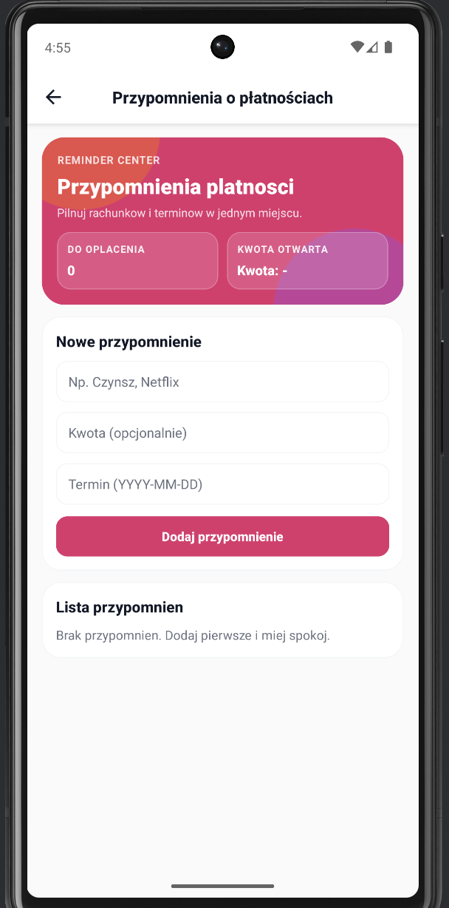
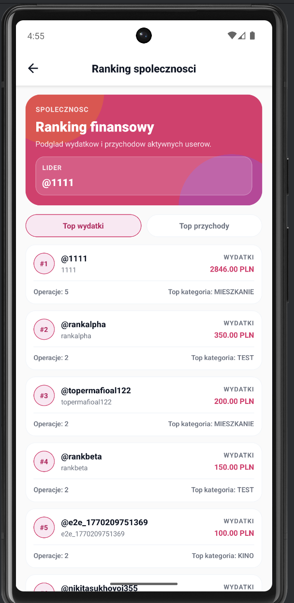
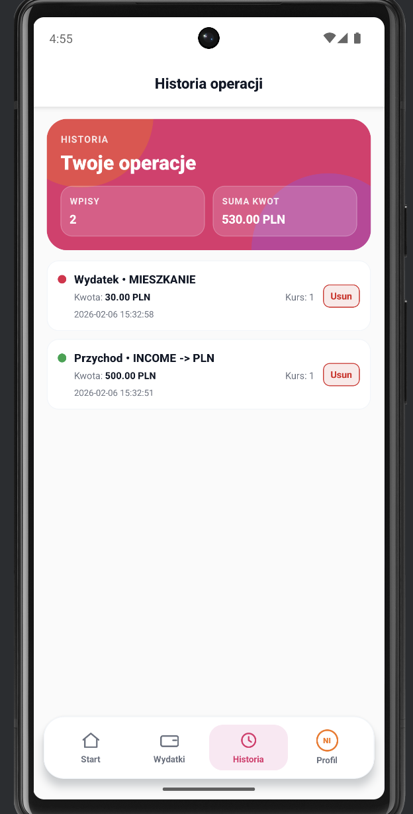
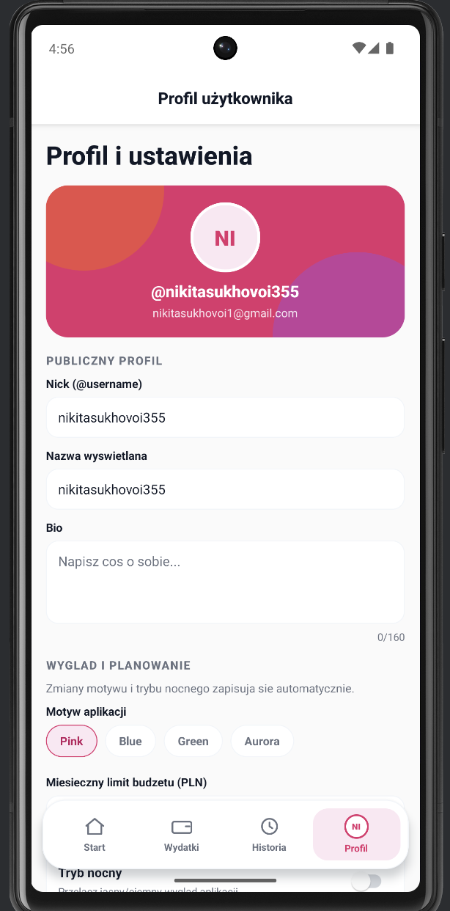
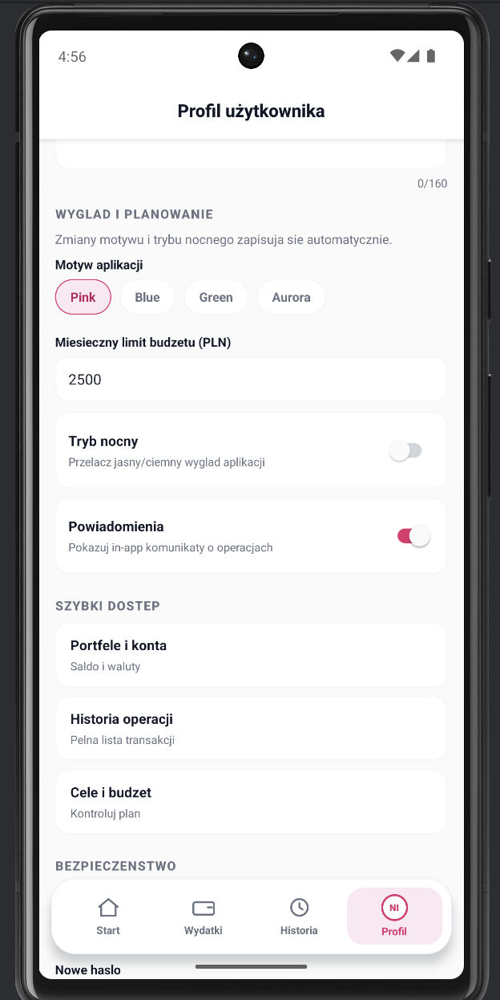

# Finanse+

Finanse+ to aplikacja do codziennego ogarniania budzetu: przychody, wydatki, cele i przypomnienia w jednym miejscu.
Projekt ma mobilny frontend (Expo/React Native) i backend API (Node.js + Express + SQLite).

## O co chodzi w projekcie

Aplikacja powstala po to, zeby szybko odpowiadac na proste pytania:
- ile mam teraz na koncie,
- na co najwiecej wydaje,
- czy mieszcze sie w limicie miesiecznym,
- jakie platnosci mam do zrobienia,
- jak idzie realizacja celow oszczednosciowych.

Dodatkowo jest ekran spolecznosciowy z rankingiem userow (wydatki/przychody).

---

## Najwazniejsze funkcje

### Konto i logowanie
- rejestracja i logowanie,
- autoryzacja przez JWT,
- prywatne endpointy zabezpieczone tokenem.

### Portfel i transakcje
- dodawanie przychodu (PLN),
- dodawanie wydatku z kategoria,
- historia operacji,
- usuwanie transakcji z poprawnym cofnieciem zmian w saldzie.

### Cele i przypomnienia
- tworzenie celow oszczednosciowych,
- odkladanie srodkow na cel,
- usuwanie celow,
- tworzenie przypomnien platnosci,
- oznaczanie przypomnienia jako oplacone/nieoplacone,
- usuwanie przypomnien.

### Profil i personalizacja
- zmiana nicku, nazwy wyswietlanej i bio,
- zmiana hasla,
- wlaczanie/wylaczanie powiadomien in-app,
- motywy: `pink`, `blue`, `green`, `aurora`,
- tryb nocny,
- miesieczny limit budzetu,
- wlasne kategorie wydatkow (dodawanie/usuwanie).

### Statystyki
- wykres wydatkow po kategoriach,
- podsumowanie na dashboardzie,
- leaderboard globalny (top wydatki lub top przychody).

---

## Stos technologiczny

### Mobile (`mobile/`)
- React Native (Expo)
- React Navigation
- Axios
- react-native-svg

### Backend (`server/`)
- Node.js
- Express
- SQLite (`sqlite3`)
- JWT (`jsonwebtoken`)
- bcrypt
- dotenv
- cors

---

## Struktura projektu

```text
finanse+/
  mobile/
    App.js
    src/
      api/
      components/
      navigation/
      screens/
      styles/ (moduly styli per ekran/komponent)
      theme/
  server/
    app.js
    db.js
    middleware/
    routes/
    elitekantor.db
  README.md
```

---

## Jak uruchomic lokalnie

### 1) Backend

```bash
cd server
npm install
node app.js
```

Domyslnie backend dziala na `http://localhost:3000`.

### 2) Mobile

```bash
cd mobile
npm install
npm start
```

Przydatne komendy:

```bash
npm run web
npm run android
npm run ios
```

---

## API (skrot)

Bazowy URL: `http://localhost:3000/api`

### Publiczne
- `POST /auth/register`
- `POST /auth/login`
- `POST /auth/logout`

### Chronione (Bearer token)

- Wallet:
  - `POST /wallet/topup`
  - `GET /wallet/portfolio`
- Transactions:
  - `POST /transactions/expense`
  - `POST /transactions/buy`
  - `POST /transactions/sell`
  - `GET /transactions/history`
  - `DELETE /transactions/:transactionId`
- Goals:
  - `GET /goals`
  - `POST /goals`
  - `POST /goals/:goalId/contribute`
  - `DELETE /goals/:goalId`
- Reminders:
  - `GET /reminders`
  - `POST /reminders`
  - `PATCH /reminders/:reminderId`
  - `DELETE /reminders/:reminderId`
- Profile:
  - `GET /profile/me`
  - `PUT /profile/me`
  - `PUT /profile/password`
- Stats:
  - `GET /stats/leaderboard?metric=expenses|income`

---

## Zrzuty ekranu dzialajacej aplikacji

Ponizej znajduje sie dokumentacja wizualna najwazniejszych ekranow aplikacji uruchomionej w emulatorze. Zrzuty pokazuja pelny przeplyw uzytkownika: logowanie, dashboard, operacje finansowe, historie, cele, przypomnienia, statystyki i profil.

| Ekran | Zrzut |
| --- | --- |
| Logowanie do aplikacji |  |
| Dashboard / saldo glowne |  |
| Dodawanie przychodu |  |
| Dodawanie wydatku |  |
| Plan i cele |  |
| Przypomnienia o platnosciach |  |
| Ranking globalny|  |
| Historia operacji |  |
| Profil i personalizacja  |  |
| Profil i personalizacja |  |

---

## Bibliografia

1. Expo Documentation, dokumentacja platformy Expo dla aplikacji React Native, https://docs.expo.dev/ (data dostepu: 10.04.2026).
2. React Native Documentation, dokumentacja frameworka React Native, https://reactnative.dev/docs/getting-started (data dostepu: 15.04.2026).
3. React Documentation, dokumentacja biblioteki React, https://react.dev/ (data dostepu: 19.04.2026).
4. React Navigation Documentation, dokumentacja nawigacji w aplikacjach React Native, https://reactnavigation.org/docs/getting-started (data dostepu: 12.05.2026).
5. Axios Documentation, dokumentacja klienta HTTP Axios, https://axios-http.com/docs/intro (data dostepu: 6.03.2026).
6. react-native-svg Documentation, dokumentacja biblioteki SVG dla React Native, https://github.com/software-mansion/react-native-svg (data dostepu: 22.03.2026).
7. Express Documentation, dokumentacja frameworka Express dla Node.js, https://expressjs.com/ (data dostepu: 22.03.2026).
8. SQLite Documentation, dokumentacja bazy danych SQLite, https://www.sqlite.org/docs.html (data dostepu: 29.03.2026).
9. node-sqlite3 Documentation, dokumentacja pakietu sqlite3 dla Node.js, https://github.com/TryGhost/node-sqlite3 (data dostepu: 28.03.2026).
10. jsonwebtoken Documentation, dokumentacja pakietu do obslugi tokenow JWT, https://github.com/auth0/node-jsonwebtoken (data dostepu: 27.04.2026).
11. bcrypt Documentation, dokumentacja pakietu bcrypt dla Node.js, https://github.com/kelektiv/node.bcrypt.js (data dostepu: 01.05.2026).
12. dotenv Documentation, dokumentacja pakietu dotenv, https://github.com/motdotla/dotenv (data dostepu: 01.05.2026).
13. CORS middleware for Express, dokumentacja pakietu cors, https://github.com/expressjs/cors (data dostepu: 01.05.2026).
